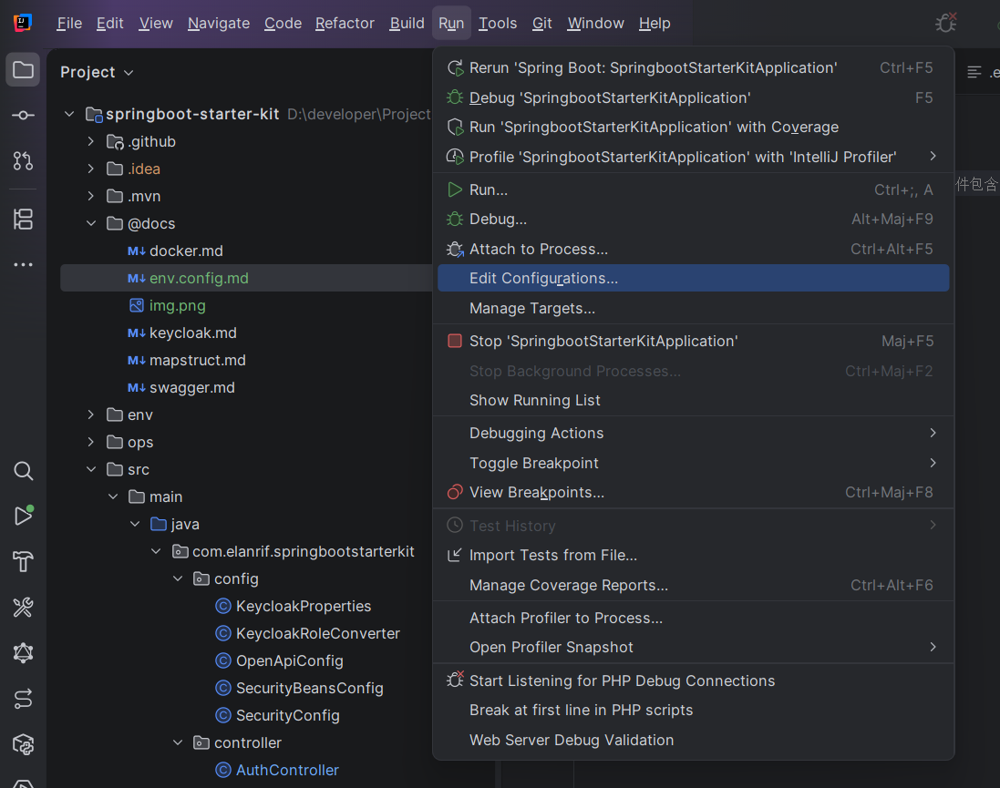
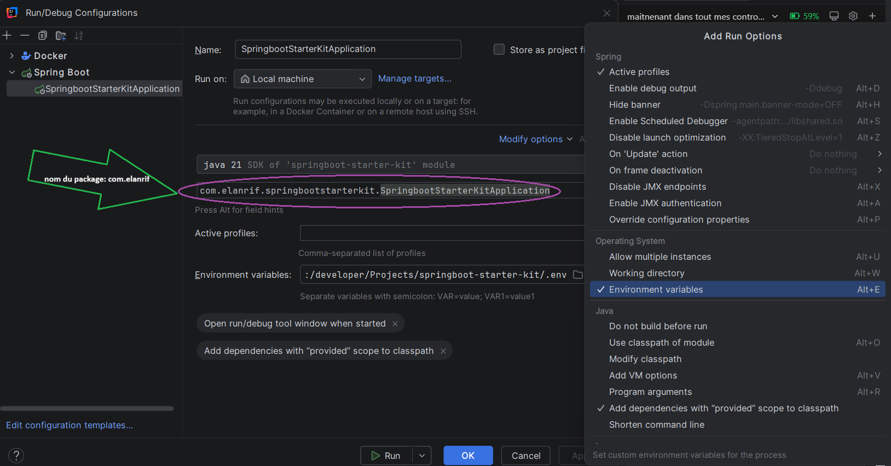
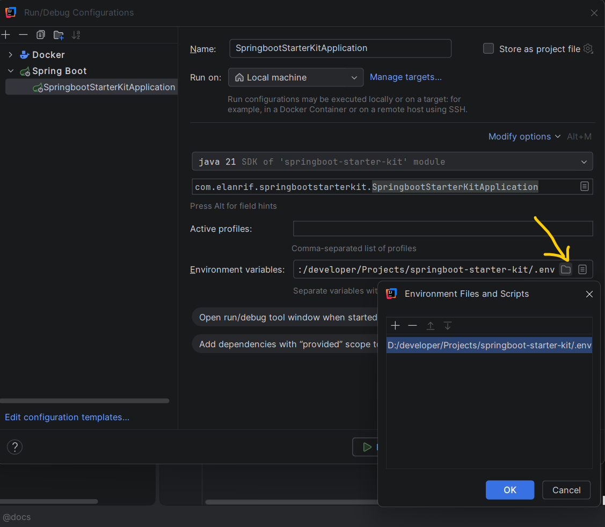

# Configurer le fichier `.env` dans IntelliJ

1. Ouvrez **Run/Debug Configurations** puis sélectionnez la configuration de l'application.

 

2. Dans la configuration, ouvrez **Modify options** et activez l’option liée au fichier d’environnement (`EnvFile`).
 
⚠️ on peut modifier le nom du package com.elanrif ici !

 

3. Ajoutez votre fichier `.env` dans la section **Environment files**, puis appliquez la configuration.

