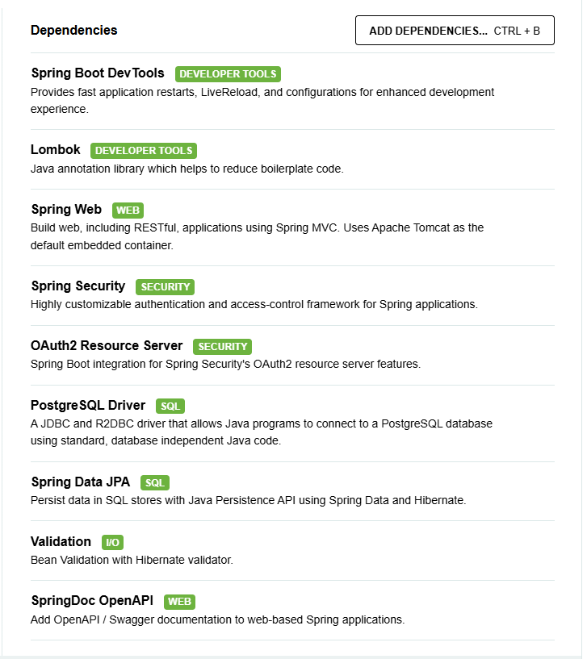

# Spring Boot Starter Kit

A starter kit for building Spring Boot applications with essential dependencies pre-configured.

## Requirements
- **Java Version:** 21
- **Maven** (for building the project)
- **PostgreSQL** (if used locally)

## Youtube account channel: [Coding with Armand](https://www.youtube.com/@CodingWithArmand/playlists)
Here are some useful playlists and videos related to Spring Boot, Keycloak, Docker, and DevOps:
- [v2 (5 months ago): SSO Spring Boot and Keycloak](https://www.youtube.com/watch?v=AUZoo41G9Rc&list=PLrxoz0ybIcc6NfkNsBfVasxehN3Fwf0mz&index=3)
- [v1 (1 year ago): version Spring Boot and Keycloak](https://www.youtube.com/watch?v=Qah3Tc85rP4&list=PLrxoz0ybIcc4bVl-EOFj6cgZf-czfRVWd&index=7)
- [Spring Boot and Docker](https://www.youtube.com/watch?v=IzM9-g6en3Q&list=PLrxoz0ybIcc4bVl-EOFj6cgZf-czfRVWd&index=10)
- [Spring Boot DevOps](https://www.youtube.com/watch?v=vJkaJ6k54AQ&list=PLrxoz0ybIcc5xggQWw7zSSk27xJdD3_UM)
- [Spring Boot + JWT and React full tutorial](https://www.youtube.com/watch?v=XS0snOP0PPM&list=PLrxoz0ybIcc6NfkNsBfVasxehN3Fwf0mz)

## Installed Dependencies

The following dependencies are installed in this project:

| Dependency                                                                              | Category | Description |
|-----------------------------------------------------------------------------------------|----------|-------------|
| Spring Boot DevTools                                                                    | Developer Tools | Provides fast application restarts, LiveReload, and configurations for enhanced development experience. |
| Lombok                                                                                  | Developer Tools | Java annotation library which helps to reduce boilerplate code. |
| Spring Web                                                                              | Web | Build web, including RESTful, applications using Spring MVC. Uses Apache Tomcat as the default embedded container. |
| Spring Security                                                                         | Security | Highly customizable authentication and access-control framework for Spring applications. |
| OAuth2 Resource Server                                                                  | Security | Spring Boot integration for Spring Security's OAuth2 resource server features. |
| PostgreSQL Driver                                                                       | SQL | A JDBC and R2DBC driver that allows Java programs to connect to a PostgreSQL database using standard, database independent Java code. |
| Spring Data JPA                                                                         | SQL | Persist data in SQL stores with Java Persistence API using Spring Data and Hibernate. |
| Spring Validation                                                                       | Web | Bean Validation with Hibernate validator. |
| SpringDoc OpenAPI                                                                       | Documentation | OpenAPI 3 documentation for Spring Boot applications. |
| ⚠️ [MapStruct](https://mapstruct.org/documentation/stable/reference/html/#introduction) | Developer Tools | Code generator that simplifies mappings between Java bean types. |

