# Keycloak — Guide d'intégration complet

Ce guide décrit l'intégration Keycloak réellement utilisée dans ce backend Spring Boot : le backend agit comme **Resource Server**, les JWT Keycloak sont validés par Spring Security, et un provisionnement local à la première connexion garde la table `users` synchronisée.

---

## Table des matières

1. [Démarrer Keycloak](#1-démarrer-keycloak)
2. [Les 3 options d'intégration](#2-les-3-options-dintégration)
3. [Mon choix d'implémentation](#3-mon-choix-dimplémentation)
4. [Créer le Realm](#4-créer-le-realm)
5. [Créer le Client](#5-créer-le-client)
6. [Créer les Realm Roles](#6-créer-les-realm-roles)
7. [Configurer le rôle par défaut](#7-configurer-le-rôle-par-défaut)
8. [Ajouter des attributs custom (phoneNumber)](#8-ajouter-des-attributs-custom-phonenumber)
9. [Configurer les variables d'environnement](#9-configurer-les-variables-denvironnement)
10. [Architecture de l'intégration](#10-architecture-de-lintégration)

---

## 1. Démarrer Keycloak

### Via Docker

```bash
docker run -d \
  --name keycloak \
  -p 8080:8080 \
  -e KC_BOOTSTRAP_ADMIN_USERNAME=admin \
  -e KC_BOOTSTRAP_ADMIN_PASSWORD=admin \
  quay.io/keycloak/keycloak:latest \
  start-dev
```

Keycloak sera accessible sur `http://localhost:8080`.

Console d'administration : `http://localhost:8080/admin`

---

## 2. Les 3 options d'intégration

1. **ROPC / Direct access grants** : le front envoie email/password à Keycloak.
2. **Authorization Code Flow** : redirection vers Keycloak, flow recommandé pour une app web.
3. **Backend Resource Server avec JWT Keycloak** : le front s'authentifie via Keycloak, puis envoie le token au backend Spring Boot.

---

## 3. Mon choix d'implémentation

J'ai choisi l'option **3**.

Pourquoi :
- elle correspond au code réellement présent ;
- Spring Boot valide les JWT Keycloak ;
- les rôles Keycloak sont convertis en authorities Spring ;
- l'utilisateur local est provisionné au premier passage via `JitProvisioningFilter`.

---

## 4. Créer le Realm

Un **Realm** est un espace isolé qui regroupe utilisateurs, clients et rôles.

1. Connecte-toi à la console admin : `http://localhost:8080/admin`
2. Clique sur le dropdown **Keycloak** (en haut à gauche) → **Create realm**
3. Remplis :

| Champ      | Valeur            |
| ---------- | ----------------- |
| Realm name | `kickstart-realm` |
| Enabled    | ON                |

4. Clique **Create**

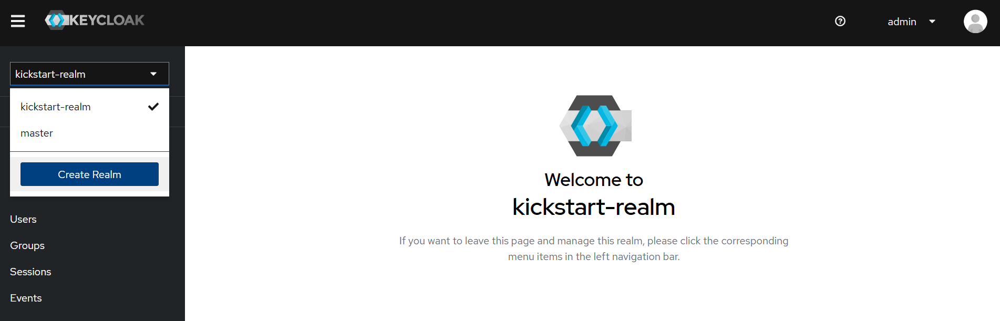
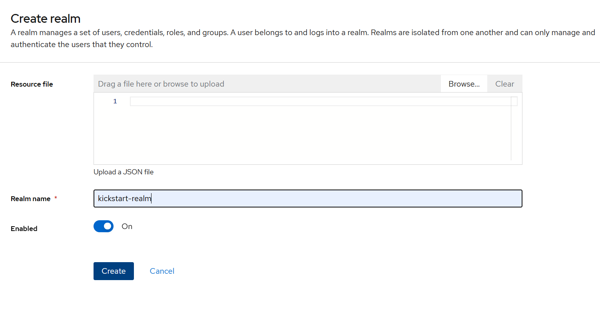

---

## 5. Créer le Client

Le **Client** représente l'application front qui obtient les tokens Keycloak.

### Step 1 — General settings

Sidebar → **Clients** → **Create client**

| Champ       | Valeur             |
| ----------- | ------------------ |
| Client type | OpenID Connect     |
| Client ID   | `kickstart-client` |
| Name        | Kickstart App      |

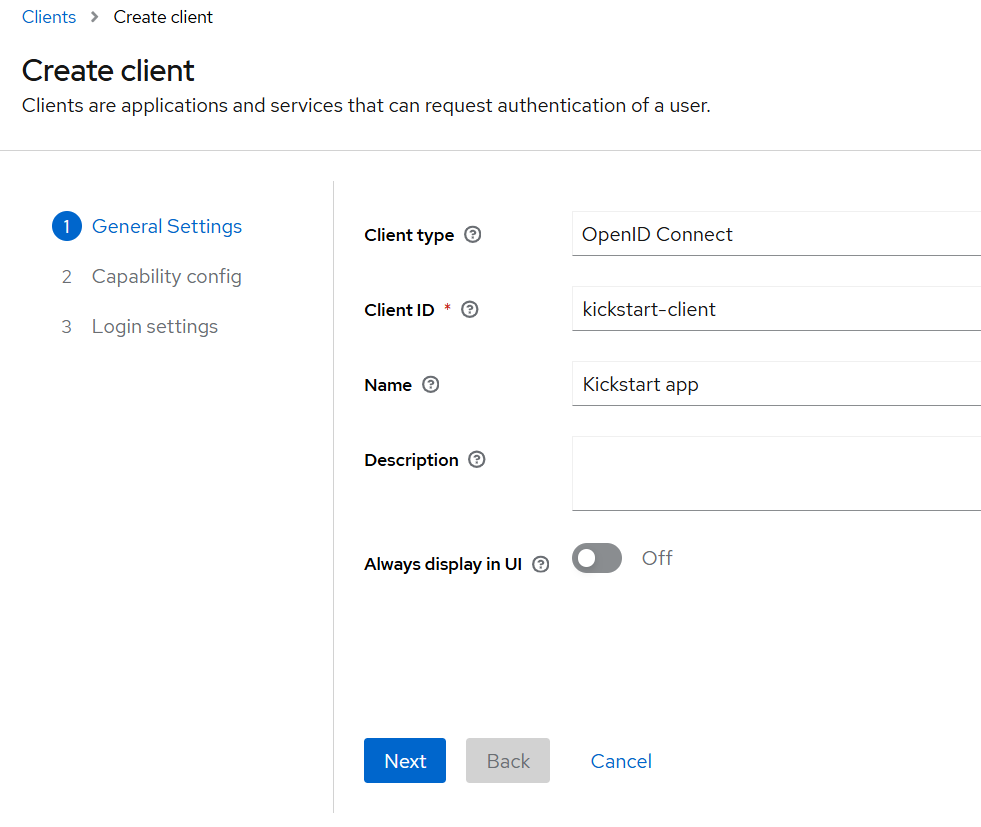

### Step 2 — Capability config

| Option                   | Valeur                         |
| ------------------------ | ------------------------------ |
| Client authentication    | ON si client confidentiel      |
| Authorization            | OFF                            |
| Standard flow            | ✓                              |
| Direct access grants     | selon le flow choisi           |
| Implicit flow            | ☐                              |
| Service accounts roles   | ☐                              |

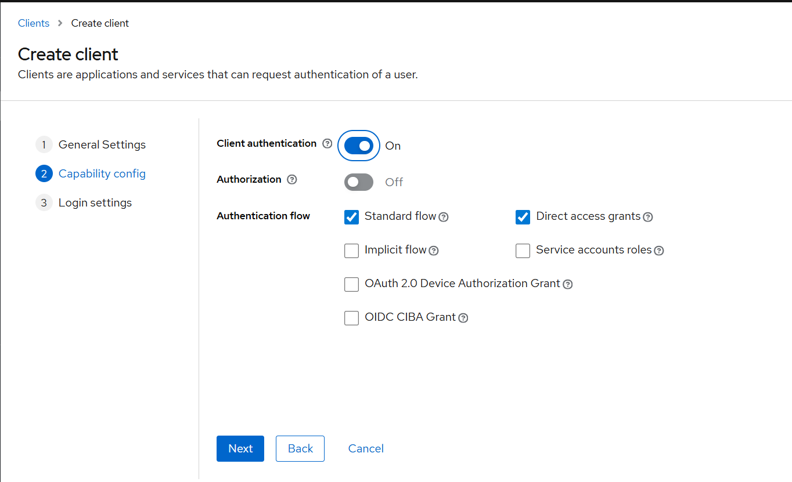

### Step 3 — Login settings

| Champ                           | Valeur                    |
| ------------------------------- | ------------------------- |
| Root URL                        | `http://localhost:3000`   |
| Home URL                        | `http://localhost:3000`   |
| Valid redirect URIs             | `http://localhost:3000/*` |
| Valid post logout redirect URIs | `http://localhost:3000/*` |
| Web origins                     | `http://localhost:3000`   |

### Récupérer le Client Secret

**Clients → kickstart-client → Credentials** → copier le **Client secret** si tu utilises un client confidentiel.

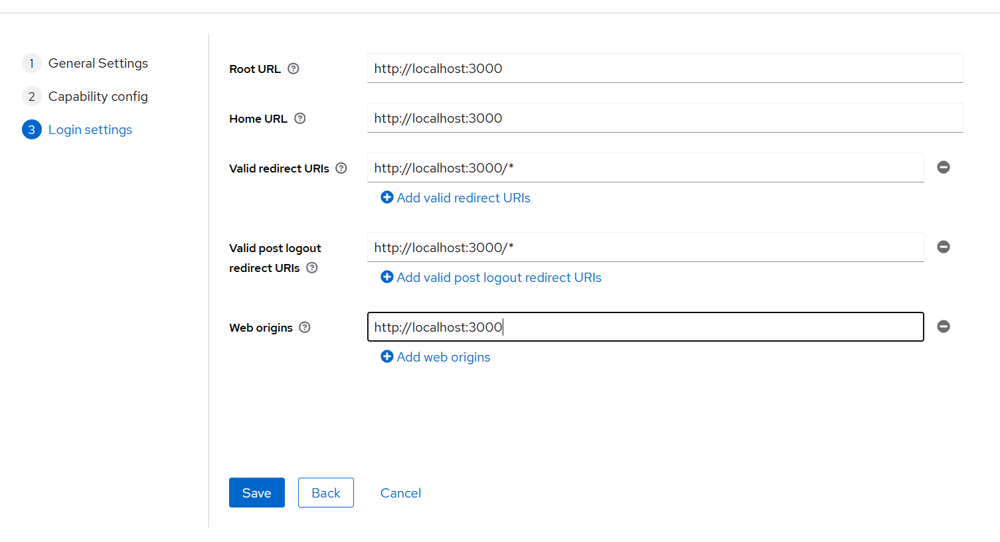
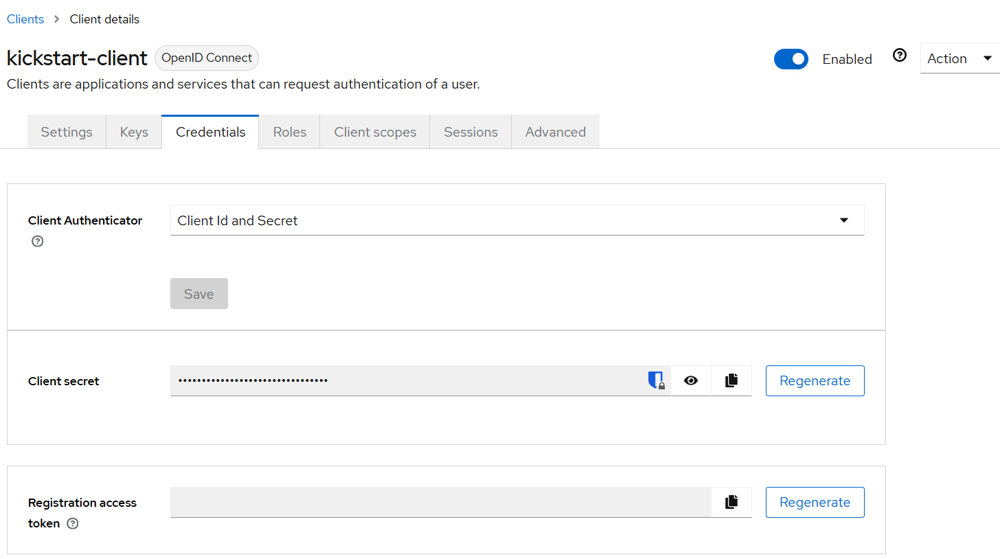

---

## 6. Créer les Realm Roles

Les rôles `USER` et `ADMIN` sont utilisés pour déterminer les droits dans l'application.

1. Sidebar → **Realm roles** → **Create role**
2. Créer `USER`
3. Créer `ADMIN`

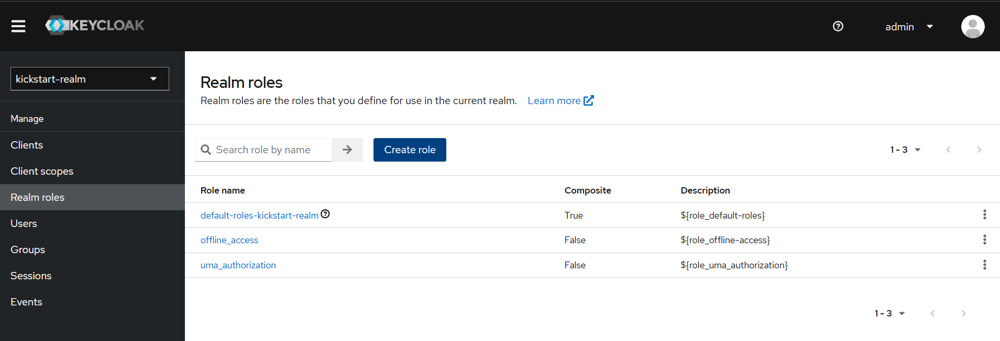
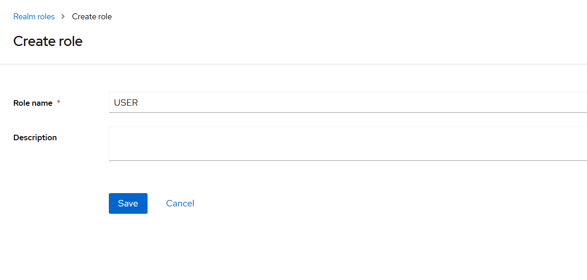
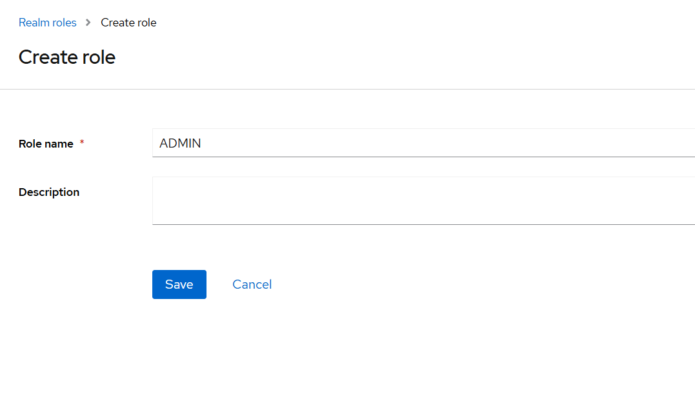

---

## 7. Configurer le rôle par défaut

Chaque nouvel utilisateur créé reçoit automatiquement le rôle `USER`.

1. Sidebar → **Realm settings**
2. Onglet **User registration**
3. Sous-onglet **Default roles**
4. Clique **Assign role**
5. Coche `USER`
6. Clique **Assign**

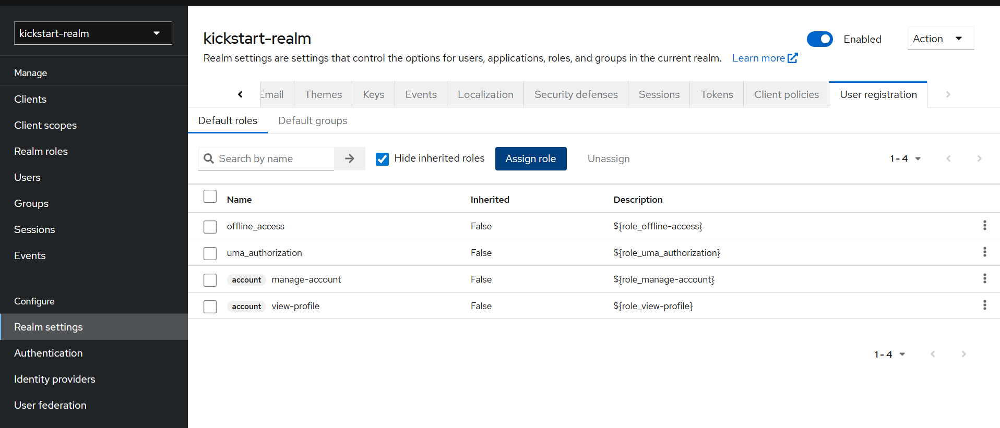
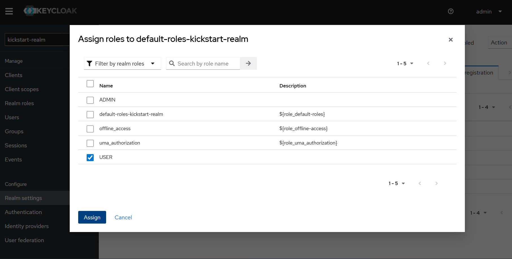

---

## 8. Ajouter des attributs custom (phoneNumber)

Par défaut, Keycloak retourne dans le token : `sub`, `email`, `given_name`, `family_name`.

Pour inclure des champs custom comme `phoneNumber`, il faut configurer un **Mapper**.

### 8.1 — Ajouter le mapper sur le client

**Clients → kickstart-client → Client scopes → kickstart-client-dedicated → Add mapper → By configuration → User Attribute**

| Champ                      | Valeur         |
| -------------------------- | -------------- |
| Name                       | `phoneNumber`  |
| User Attribute             | `phoneNumber`  |
| Token Claim Name           | `phone_number` |
| Claim JSON Type            | `String`       |
| Add to ID token            | ON             |
| Add to access token        | ON             |
| Add to userinfo            | ON             |

### 8.2 — Côté backend

Le backend peut lire ces claims via le JWT et les réutiliser lors du provisionnement local.

---

## 9. Configurer les variables d'environnement

```bash
KC_URL=http://localhost:8080
KC_REALM=kickstart-realm
KC_CLIENT_ID=kickstart-client
KC_CLIENT_SECRET=<si client confidentiel>
KC_ADMIN_CLIENT_ID=admin-cli
KC_ADMIN_USERNAME=admin
KC_ADMIN_PASSWORD=admin
```

---

## 10. Architecture de l'intégration

```text
Client front
   │
   ▼
Keycloak
   │
   ▼
Spring Boot Resource Server
   │
   ├── SecurityConfig
   │   └── valide les JWT Keycloak
   │
   ├── KeycloakJwtAuthConverter
   │   └── transforme les rôles Keycloak en autorités Spring
   │
   └── JitProvisioningFilter
       └── crée l'utilisateur local au premier passage si nécessaire
```

### Fichiers du backend concernés

| Fichier | Rôle |
| --- | --- |
| `src/main/java/com/elanrif/springbootstarterkit/config/SecurityConfig.java` | Configuration Spring Security avec profil Keycloak |
| `src/main/java/com/elanrif/springbootstarterkit/config/KeycloakJwtAuthConverter.java` | Conversion JWT → authorities Spring |
| `src/main/java/com/elanrif/springbootstarterkit/config/JitProvisioningFilter.java` | Provisionnement à la volée de l'utilisateur local |

### Ce que fait le backend

- valide le JWT Keycloak ;
- extrait l'email et les rôles ;
- mappe les rôles `USER` / `ADMIN` sur `ROLE_USER` / `ROLE_ADMIN` ;
- crée l'utilisateur local si besoin ;
- protège les routes selon les authorities Spring.
