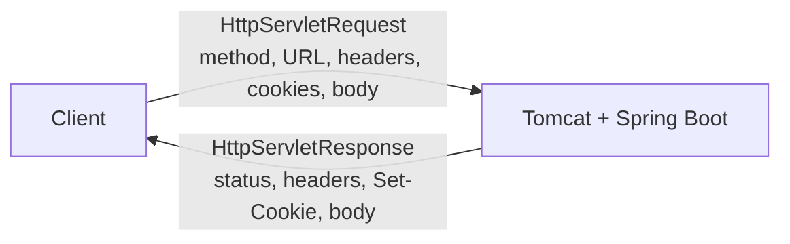
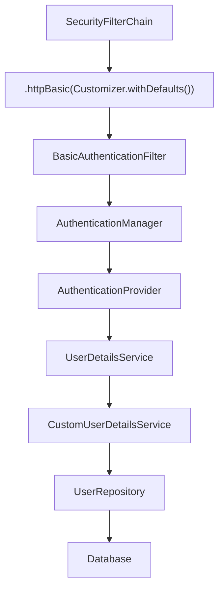
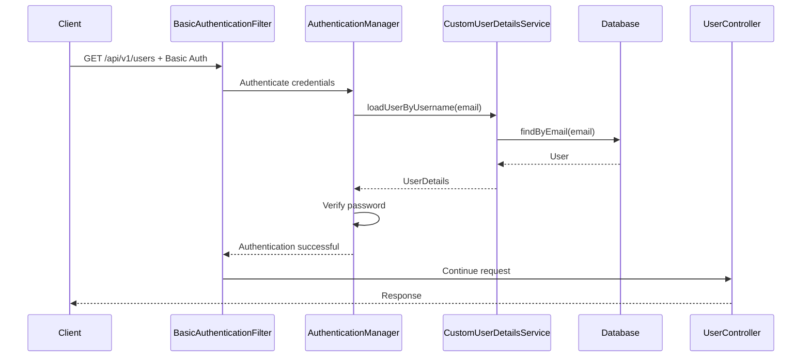
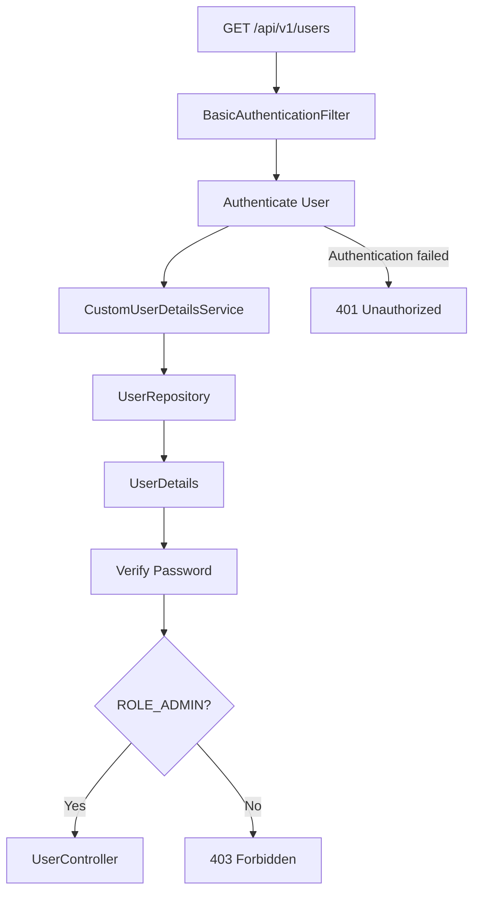
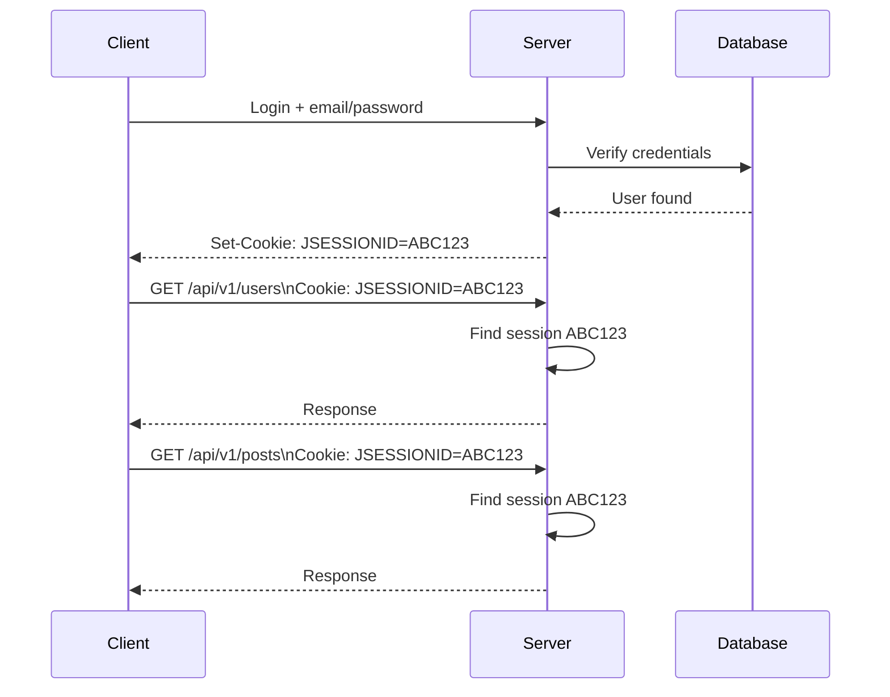
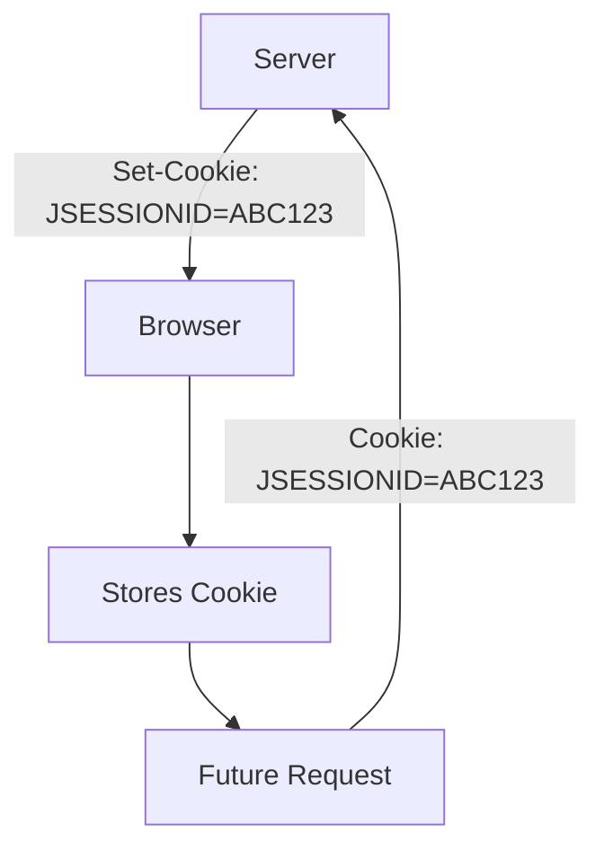
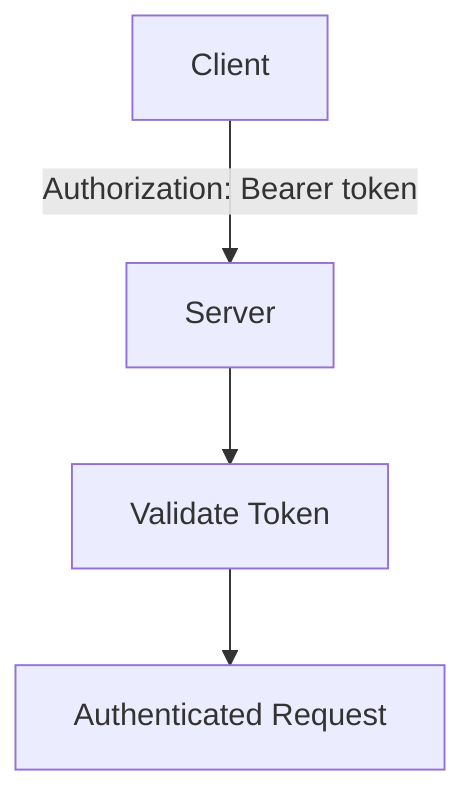
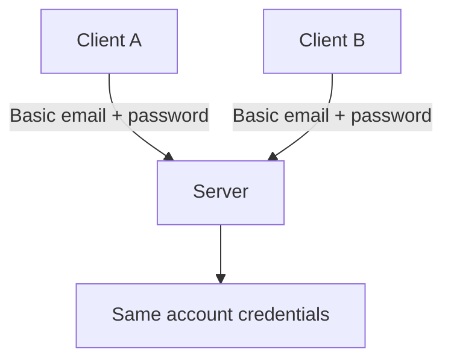
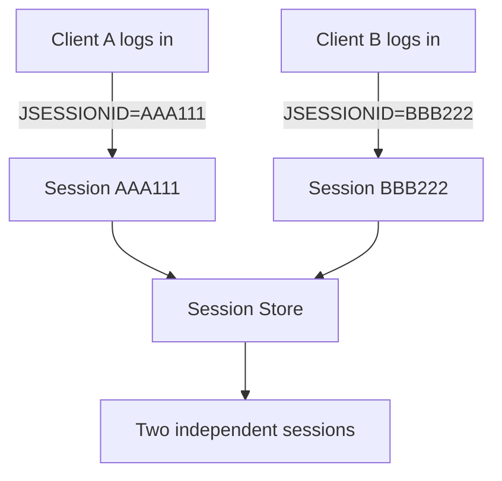

# Why Authentication Uses Headers (Basic Auth, Cookies, and Bearer Tokens) Instead of Body or URL Params

## 1. Background — What `HttpServletRequest` and `HttpServletResponse` Actually Are

In Spring Boot, every incoming HTTP request is handled by an embedded server (Tomcat by default).

For each request, the server provides Spring with two objects:

* `HttpServletRequest` — represents everything coming **into** the server.
* `HttpServletResponse` — represents everything going **out** of the server.

Together, they represent the complete HTTP request/response exchange.



`HttpServletRequest` contains:

* HTTP method (`GET`, `POST`, etc.)
* URL and query parameters
* request headers
* cookies
* request body

It is mainly used for **reading** information from the incoming request.

`HttpServletResponse` contains:

* HTTP status code (`200`, `404`, etc.)
* response headers
* `Set-Cookie`
* response body

It is mainly used for **writing** information into the outgoing response.

Spring provides higher-level tools that read and write these objects for you:

```java
@RequestBody
@RequestParam
@PathVariable
ResponseEntity
```

For example, `@RequestBody` reads data from the request body, while `ResponseEntity` helps build the response.

---

# 2. HTTP Basic Authentication — The Simplest Example

Before understanding sessions and Bearer tokens, it is useful to start with **HTTP Basic Authentication**.

With Basic Auth, the client sends the username and password in the `Authorization` header **on every request**.

For example:

```http
GET /api/v1/users HTTP/1.1
Host: localhost:8080
Authorization: Basic <Base64(email:password)>
```

Conceptually:

```text
email    = admin@example.com
password = password123
```

The credentials are encoded as:

```text
Base64("admin@example.com:password123")
```

Base64 is **not encryption**. Therefore, Basic Auth should always be used over **HTTPS**.

---

## 2.1 How Spring Security Enables Basic Auth

In Spring Boot, Basic Authentication can be enabled in the `SecurityFilterChain`:

```java
@Bean
public SecurityFilterChain securityFilterChain(
        HttpSecurity http) throws Exception {

  http
          .authorizeHttpRequests(auth -> auth
                  .requestMatchers("/api/v1/users/**")
                  .hasRole("ADMIN")
                  .anyRequest()
                  .authenticated()
          )
          .httpBasic(Customizer.withDefaults());

  return http.build();
}
```

# ⛔ Basic Auth + Session: Why Wrong Passwords Were Accepted

## Bug
With `IF_REQUIRED` session policy, after one successful Basic Auth login, Spring stores the `SecurityContext` in <br/>
the session. On later requests, `BasicAuthenticationFilter` skips re-checking the <br/>
password **if the username matches** the one already authenticated in session <br/>
— so a wrong password with the same (correct) email got through.<br/>

## Fix
```java
session.sessionCreationPolicy(SessionCreationPolicy.STATELESS)
```
No session stored/read → every request re-verified from scratch.<br/>

## Where the password check happens
`CustomUserDetailsService` only fetches the user — it doesn't compare passwords.<br/> 
Spring auto-builds a `DaoAuthenticationProvider` from your `UserDetailsService` + `PasswordEncoder` beans, <br/>
and it's this provider that internally calls `passwordEncoder.matches(rawPassword, storedHash)`.<br/>

## Why the `PasswordEncoder` bean is needed<br/>
Without it, Spring defaults to `DelegatingPasswordEncoder`, which expects a `{bcrypt}` prefix on stored hashes. <br/>
A plain `BCryptPasswordEncoder` hash has no prefix → throws `No PasswordEncoder mapped for id "null"`. <br/>
Declaring `BCryptPasswordEncoder` explicitly avoids this.<br/>

## STATELESS vs IF_REQUIRED<br/>

| | IF_REQUIRED | STATELESS |
|---|---|---|
| Session | Created & reused | Never created/read |
| Use case | Web login w/ cookies | REST APIs (Basic/JWT) |
| Credentials | Checked once | Checked every request |

**Mismatch risk:** session-based auth + `STATELESS` → forces re-login every request. <br/>
Stateless auth (Basic/JWT) + `IF_REQUIRED` → password can be silently skipped on later requests (this bug).<br/>


The important line is:

```java
.httpBasic(Customizer.withDefaults());
```

This tells Spring Security to configure the **HTTP Basic Authentication mechanism**.

Spring Security then adds the necessary filters to the security filter chain, including `BasicAuthenticationFilter`.



---

## 2.2 `UserDetailsService`

Spring Security provides the `UserDetailsService` interface as a contract for loading users.

We can provide our own implementation:

```java
@Service
@RequiredArgsConstructor
public class CustomUserDetailsService implements UserDetailsService {

  private final UserRepository userRepository;

  @Override
  public UserDetails loadUserByUsername(String email) {

    return userRepository.findByEmail(email)
            .map(user -> User.withUsername(user.getEmail())
                    .password(user.getPassword())
                    .roles(user.getRole().name())
                    .build()
            )
            .orElseThrow(() ->
                    new UsernameNotFoundException("User not found")
            );
  }
}
```

Two things are important here.

### `implements UserDetailsService`

This tells Spring Security that the class follows the `UserDetailsService` contract.

Spring Security can therefore use it when it needs to load a user.

### `@Service`

This registers the class as a Spring bean.

The class name `CustomUserDetailsService` is not special. What matters is that the class:

```java
implements UserDetailsService
```

and is registered as a Spring bean.

---

## 2.3 Complete Basic Auth Flow

When the client sends:

```http
GET /api/v1/users
Authorization: Basic <Base64(email:password)>
```

the controller does **not** manually read the `Authorization` header.

Spring Security processes authentication first.



The controller can therefore remain simple:

```java
@GetMapping
public ResponseEntity<?> getUsers() {
  return ResponseEntity.ok(userService.getAllUsers());
}
```

---

## 2.4 Authentication vs Authorization

Authentication answers:

> **Who are you?**

Authorization answers:

> **Are you allowed to access this resource?**

For example:

```java
.requestMatchers("/api/v1/users/**")
.hasRole("ADMIN")
```

The complete flow is:



Therefore:

* **401 Unauthorized** → authentication failed or credentials are missing/invalid.
* **403 Forbidden** → authentication succeeded, but the user does not have the required role.

---

# 3. The Problem With Basic Authentication

Basic Auth works, but it has an important weakness:

**the password is sent with every request.**

For example:

```text
Request 1 → email + password
Request 2 → email + password
Request 3 → email + password
Request 4 → email + password
```

This means the server has to repeatedly verify the credentials.

Password hashing algorithms such as BCrypt or Argon2 are intentionally expensive to compute.

The client also has to keep the user's password available so it can continue sending it.

This is why applications commonly authenticate the user **once**, then use a temporary authentication mechanism for subsequent requests.

---

# 4. Sessions and Cookies — Authenticate Once, Then Use a Session ID

Instead of sending the password on every request, the client can authenticate once.

The server then creates a session and gives the client a session identifier.



The important difference is:

```text
Basic Auth:

Request → email + password
Request → email + password
Request → email + password


Session:

Login → email + password
Request → session ID
Request → session ID
Request → session ID
```

---

## 4.1 Why Cookies Are Convenient

Browsers automatically manage cookies.

If the server sends:

```http
Set-Cookie: JSESSIONID=ABC123
```

the browser stores it and automatically sends it on subsequent matching requests:

```http
Cookie: JSESSIONID=ABC123
```

The frontend does not need to manually add the cookie to every request.



---

## 4.2 `HttpOnly`

A cookie can be marked as:

```http
HttpOnly
```

An `HttpOnly` cookie cannot be read by JavaScript through APIs such as `document.cookie`.

This helps reduce the ability of injected JavaScript to directly steal the session cookie during an XSS attack.

Other cookie attributes can provide additional protections, such as:

```text
HttpOnly
Secure
SameSite
```

---

# 5. Why `Authorization: Bearer` Exists

Sessions and cookies work especially well with browser-based applications.

But not every client is a browser.

Applications can also communicate through:

* mobile applications
* desktop applications
* server-to-server APIs
* microservices
* command-line clients

In these cases, explicitly sending an authentication token can be more convenient.

This is where the `Authorization` header with the `Bearer` scheme is commonly used:

```http
GET /api/v1/users
Authorization: Bearer eyJhbGciOi...
```

The client explicitly attaches the token to requests.



Unlike cookies, the client is generally responsible for deciding when and how the token is attached.

---

# 6. Basic Auth vs Session vs Bearer Token

The three mechanisms solve the same general problem — **authenticating requests** — but they work differently.

|                                | Basic Auth                    | Session / Cookie | Bearer Token                      |
| ------------------------------ | ----------------------------- | ---------------- | --------------------------------- |
| Sent on every request          | Email + password              | Session ID       | Token                             |
| Password sent repeatedly       | Yes                           | No               | No                                |
| Browser automatically sends it | No                            | Yes, for cookies | No                                |
| Client manually attaches it    | Usually                       | Usually not      | Yes                               |
| Server-side session required   | No                            | Usually yes      | No, depending on token design     |
| Common use                     | Simple/internal APIs, testing | Web applications | APIs, mobile, distributed systems |

---

# 7. What If Two Clients Use the Same Credentials?

Basic Auth cannot distinguish two clients using the exact same username and password.



The server knows:

> Someone possessing these credentials is making the request.

It does not automatically know which browser or device is using them.

With sessions, each successful login can create a different session:



Both sessions can belong to the same user account while still being separate sessions.

---

# 8. Why Not Put Authentication in the URL or Body?

Authentication information can technically appear in different parts of an HTTP request, but there are important reasons to prefer headers for authentication credentials or tokens.

For example, putting a token in a URL:

```http
GET /api/v1/users?token=abc123
```

can expose the token through places such as:

* browser history
* logs
* analytics systems
* proxies
* monitoring tools
* copied URLs

The request body is appropriate for data belonging to the operation itself:

```json
{
  "firstName": "Sandra",
  "lastName": "Emanuelle"
}
```

Authentication metadata is generally better represented separately using standardized HTTP authentication mechanisms such as:

```http
Authorization: Basic ...
```

or:

```http
Authorization: Bearer ...
```

Cookies are another standardized mechanism for carrying session identifiers in browser-based applications.

---

# 9. Summary

The main authentication mechanisms can be understood progressively:

```text
Basic Auth
    ↓
Send credentials with every request

Session / Cookie
    ↓
Authenticate once
    ↓
Receive a session ID
    ↓
Browser automatically sends the cookie

Bearer Token
    ↓
Authenticate once
    ↓
Receive a token
    ↓
Client explicitly sends the token
```

The important concepts are:

* `HttpServletRequest` represents the incoming HTTP request.
* `HttpServletResponse` represents the outgoing HTTP response.
* **Basic Auth** sends credentials through the `Authorization` header on every request.
* `.httpBasic(Customizer.withDefaults())` enables HTTP Basic Authentication in Spring Security.
* `UserDetailsService` provides Spring Security with a way to load the user.
* **Sessions** allow the server to authenticate once and associate subsequent requests with a session ID.
* **Cookies** allow browsers to automatically send session identifiers.
* `HttpOnly` prevents JavaScript from directly reading a cookie.
* **Bearer tokens** allow clients to explicitly send an authentication token through the `Authorization` header.
* `401` means authentication failed.
* `403` means authentication succeeded, but access was denied.
* Authentication answers **"Who are you?"**
* Authorization answers **"Are you allowed to do this?"**
