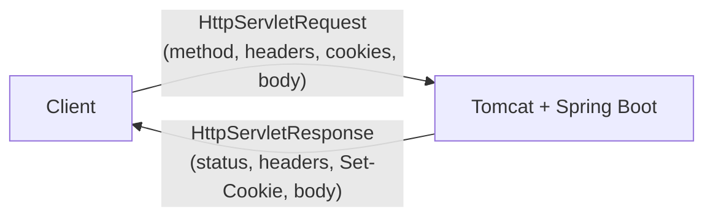
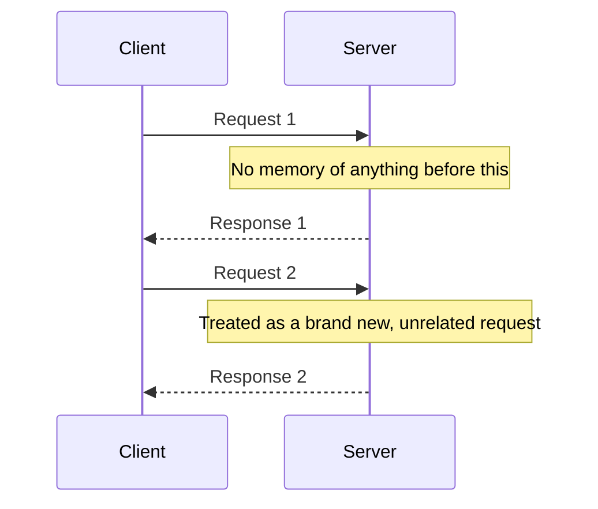
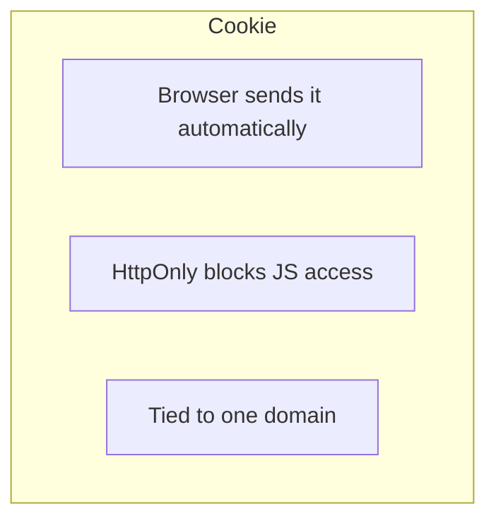
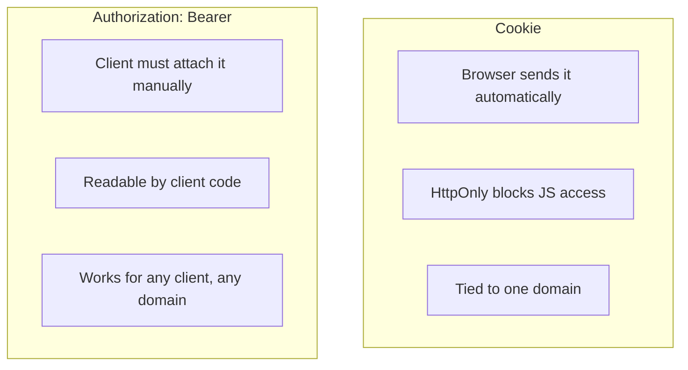
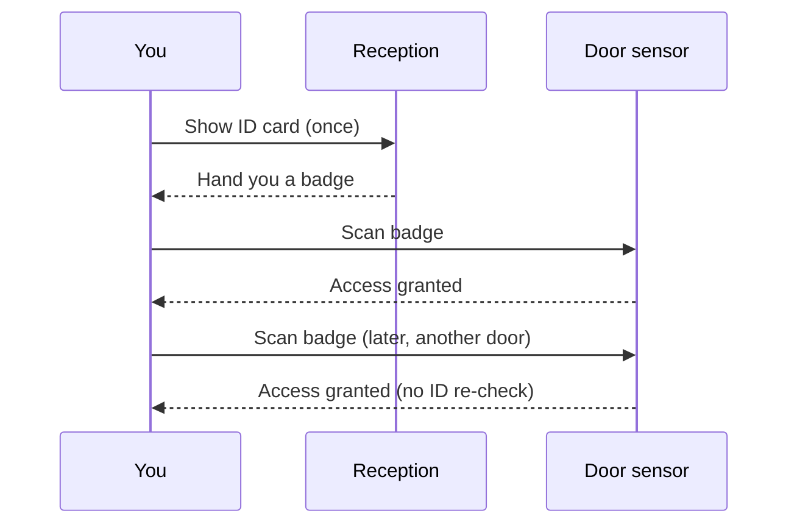
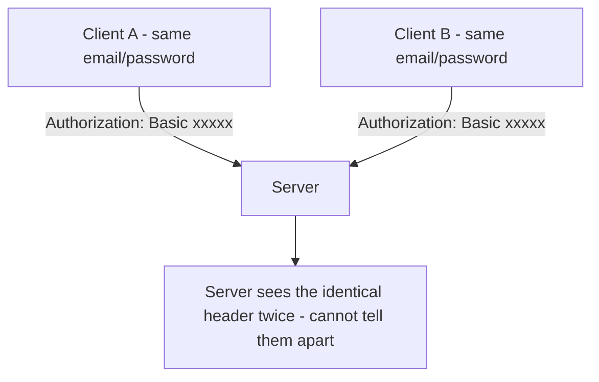
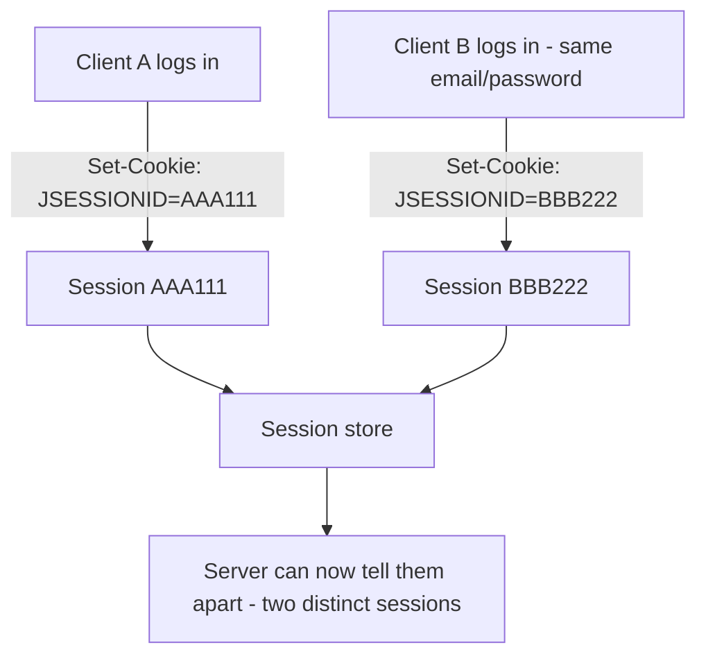

# Why Authentication Uses Headers (Cookies / Bearer Tokens) Instead of Body or URL Params 

## 1. Background — What `HttpServletRequest` and `HttpServletResponse` Actually Are 

In Spring Boot, every incoming HTTP call is handled by an embedded server (Tomcat by default). 
For each request that arrives, Tomcat creates two objects and hands them to Spring: an `HttpServletRequest` 
and an `HttpServletResponse`. These two objects together represent the **entire HTTP exchange** — 
nothing about the request or the response exists outside of them. 

 

`HttpServletRequest` represents everything that came **in** from the client: the HTTP method (GET, POST...), 
the URL and its query params, all the request headers (including the `Cookie` header), and the request body 
(the raw JSON, form data, etc.). It is mostly used for **reading** — you pull information out of it. 

`HttpServletResponse` represents everything that will go **out** back to the client: the status code (200, 404...), 
the response headers (including `Set-Cookie`), and the response body. It is mostly used for **writing** — 
you push information into it before it's sent. 

In practice, Spring gives you higher-level tools that read/write these objects for you, so you rarely touch 
them directly: `@RequestBody` reads the body out of `HttpServletRequest`, `@RequestParam`/`@PathVariable` read 
query/path values out of it, and `ResponseEntity` writes the status/body into `HttpServletResponse`. You only 
reach for the raw objects yourself when you need something these shortcuts don't cover — like manually creating 
a session or setting a cookie, as seen in the `login` method earlier. 

## 2. HTTP Is "Stateless" by Nature — You Need a Mechanism to Link Requests Together 

Every HTTP request is independent. The server has no natural way of knowing that two separate requests came from the same person. 
This is what "stateless" means: no built-in memory between calls. 

 

To solve this, you need an identifier that travels **automatically** from one request to the next. 
This is exactly the role of **headers** (whether it's the `Cookie` header or the `Authorization` header) — they were designed 
in the HTTP spec specifically for this purpose: carrying metadata *about* the request. 

The **body**, by contrast, is designed to carry the actual **business data** 
of the request (email, password, form fields, JSON payloads, etc.) — not session metadata. 
Mixing the two would blur the responsibility of each part of the request. 

## 3. Cookies — Automatic Handling by the Browser 

The browser manages sending the cookie **by itself**, on every request to the matching domain, 
without your JavaScript code needing to do anything. 

With a token in the body or URL params instead, **you (the frontend developer)** would have to: 

* Manually retrieve the token from the login response,
* Store it somewhere (localStorage/sessionStorage),
* Manually attach it to every single request.

More code to write, and more room for mistakes (forgetting to attach it on one endpoint, for example). 

### `HttpOnly` — Protection Against XSS 

A cookie marked `HttpOnly` is **completely invisible to JavaScript** — even if malicious JS runs 
on your page (an XSS vulnerability), that script cannot read the cookie to steal it. 

A token stored in the body and then kept in `localStorage`, on the other hand, **is** accessible via JavaScript — 
meaning any XSS vulnerability on your site would let an attacker steal the token directly. 

## 4. So Why Does `Authorization: Bearer` Exist at All? 

Because cookies also have a real limitation: they are **automatically scoped to a domain** by the browser. 
This is convenient for a classic web app, but becomes a problem for: 

* **Non-browser clients that don't behave like a browser** — most mobile apps and server-to-server calls don't have 
  an automatic cookie jar the way a browser (or a tool like Postman, which *does* emulate one) does. 
  Bearer tokens don't rely on any of that — the client just attaches the header itself, explicitly, every time. 
* **Architectures where multiple domains/services** need to verify the same token independently (e.g. microservices) — 
  the `Authorization` header is more universal and explicit, and doesn't depend on the browser's cookie/domain mechanism at all. 

## 5. Why Can't Email + Password Alone Identify the Client on Every Request? 

Email and password **do** identify the person — but only at the exact moment they're checked, during `login`. 
Once that HTTP request ends, the server forgets everything, since HTTP is stateless (see section 2). 

In theory you could resend email + password on every single request (this exists, it's called HTTP Basic Auth), 
but it's a bad idea in practice, for three reasons: 

* The password would travel over the network on **every** request, not just once, multiplying the risk of interception.
* Password hashing (bcrypt/argon2) is **intentionally slow** for security — recomputing it on every `GET` request 
  would be a serious performance problem.
* The client would have to keep the raw password in memory at all times to keep resending it — a bad security practice.

The fix: verify identity **once**, then hand out a lightweight, disposable "ticket" (the session cookie, or a JWT) 
that's cheap to check and easy to revoke, instead of repeating a costly, sensitive check on every request. 

Think of it like badging into a company office, say Google: at reception, you show your ID card **once**, 
and they hand you a visitor/employee badge. For the rest of the day, security only scans your badge at each door — 
they don't ask for your ID card again every time you walk through a gate. The badge is weaker proof than the ID card, 
but far cheaper to check, and it can be deactivated instantly at the end of the day without touching your actual ID. 

 

## 6. Important Nuance — Basic Auth *Does* Identify the Client, at a Cost 

A common misunderstanding: Basic Auth doesn't fail to identify who's making the request — it actually resends 
`email:password` (Base64-encoded) in the `Authorization` header on **every single request**, so the server 
re-decodes and re-verifies the account each time. The client **is** identified, every time. 

The real problem isn't identification — it's the **cost and risk** of how it's done: the password travels on the wire 
constantly, and the expensive hash check runs on every call instead of once. 

## 7. But What If Two Different Browsers Use the Exact Same Credentials? 

Here's the important nuance: **this limitation applies equally to Basic Auth and to session cookies** — neither one 
can tell two browsers apart *based on the account alone*, because it's the same account. 

With Basic Auth, Client A and Client B would send the **exact same** `Authorization: Basic ...` value on every 
request, since it's derived directly from the same email + password. The server has no way to know it's two 
different browsers — it just sees "someone who knows this password," repeatedly. 

 

With sessions, the difference appears **after login**: even though both clients typed the same email/password, 
each `login` call creates a brand-new, independently generated session ID. From that point on, the server is no 
longer comparing "the account" — it's comparing "this exact session," which is unique per login. 

 

|                                | Basic Auth                                     | Session / Cookie                             |
| ------------------------------ | ---------------------------------------------- | -------------------------------------------- |
| What's sent on every request   | The **account** (email + password)             | A **ticket for this one login** (session ID) |
| Two logins, same account       | Identical value both times — indistinguishable | Two different IDs — distinguishable          |
| What the server actually knows | "Someone who knows this password"              | "Precisely this browser's open session"      |

 

So the takeaway: identifying "the account" and identifying "this specific connected device" are two different 
problems. Basic Auth only ever solves the first one. Sessions solve the second one too, simply because a new, 
random ticket is minted at every login, regardless of whether the credentials behind it are shared. 

## Summary 

* `HttpServletRequest`/`HttpServletResponse` are the raw, complete objects behind every request/response cycle — 
  headers, body, cookies, status, all of it. Spring's shortcuts (`@RequestBody`, `ResponseEntity`) just wrap them.
* The **body** is meant to carry the **data of the request itself**, not credentials that need to automatically persist 
  across many different requests.
* **Headers** (`Cookie` or `Authorization`) provide a standard place to carry authentication-related metadata with requests.
* **Cookies** add two extra benefits on top of that: automatic browser handling, 
  and `HttpOnly` protection against XSS.
* **Bearer tokens** trade away those two browser-specific conveniences in exchange for being 
  usable by any kind of client, browser or not.
* Email/password only prove identity **once**, at login — sessions/tokens are what let that identity 
  persist cheaply and safely across many separate, stateless requests.
* Basic Auth **does** identify the client on every request, just expensively and riskily — its real 
  weakness is cost and exposure, not lack of identification.
* Neither Basic Auth nor sessions can distinguish two clients sharing the *same* credentials by account 
  alone — sessions solve this only because each login mints its own independent, random ticket.
